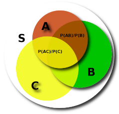

# FullText Journals.

This code download fulltext journal articles as XML
and parses them into (title, abstract, methods) text without markup. Suitable
for ingestion into machine learning
programs.

147 Journals with over 200 ISSN numbers are recognised.

You will probably need to run this code within a university subnet/VPN to allow the university library
subscription to give you access to the full text of these journals.

Install required python libraries with:

```sh
pip install -r requirements.txt
```

First we must create a CSV file containing the pubmed IDs
that we are interested in. Then we collect some metadata
such as DOI, PMCID, [ISSN](http://www.bl.uk/bibliographic/issn.html#what), TITLE etc. with:

```sh
# use 'python -m mlcode --help' for help
python -m mlcode journals --sleep=20. {csvfile}
```

Here `csvfile` is a CSV file that contains a list of PubMed IDs that we want.
You can specify the column with the option `--col`.

This will scrape the ncbi website so
the `--sleep=20.` key ensures that it is not hit too rapidly. This will
avoid you being blocked but will take sometime (e.g. 20 x #papers secs) so go get a coffee.

This generates a *metafile* `mlcode-journals.csv` (see the `--out` option). It is a CSV file that will form the basis for everything that follows. It
contains the DOIs that will allow us to find the document on the web. Pubmed IDs
that are either incorrect or unknown to NCBI will have an ISSN column set to "missing-issn".

mlcrops uses ISSN numbers to determine which code to use to download and process
the journal text.

You can stop and restart this command as you like; it checks for pmids that are already
done.

Next (*optionally*) edit the `mlcode/config.py` and alter the variables there. Specifically
we need `JCSV` to point to the newly created `metafile`.

We can then download the fulltext with:

```sh
python -m mlcode download --sleep=100. --mx=0 --mod=-cell
```

This will also take some time :). Here we are excluding the `cell` module
(see ScienceDirect section below).

Documents are stored in `{DATADIR}/xml_<ISSN>/<PMID>.html`. If the download "fails"
a stub file is stored in `{DATADIR}/failed_<ISSN>/<PMID>.html` to prevent subsequent attempts
to redownload the document. This means that you can stop/restart the download at will.


## ScienceDirect

ScienceDirect Journals require the use of selenium and chromedriver.
(Since the content is delivered as a json blob that is used to generate
the final DOM with javascript)

```sh
python -m pip install selenium
```

Download chromedriver from [here](https://sites.google.com/a/chromium.org/chromedriver/)
and place the excutable in your `PATH`.

All chromedriver downloads currently are managed by `cell.py` so we can download
them separately with:

```sh
# use option '--head' to see the browser
python -m mlcode.cell download --sleep=100. --head
```


## Viewing Downloads

You can build a set of html pages that present the Abstract/Results/Methods sections
in a simple manner. This is useful to check the code is actually finding the correct text
from within the downloaded HTML/XML.

```sh
python -m mlcode tohtml
```

You can then navigate to `{DATADIR}/html` and click on the `index.html` file to get a summary
of your data (no webserver required).

## Creating "Cleaned" BRAT Data files

These are pure textfiles suitable for ingestion
by BRAT (Stenetorp, P. et al. in *Proceedings of the Demonstrations at the 13th Conference of the European Chapter of the Association for Computational Linguistics*.  102-107) [Ref](https://dl.acm.org/doi/10.5555/2380921.2380942).

```sh
python -m mlcode clean
```

The files are generated in `{DATADIR}/cleaned`. Each file is named as `cleaned_<ISSN>_<JOURNAL>/<PMID>_cleaned.txt`.
[ISSN](http://www.bl.uk/bibliographic/issn.html#what) is a "number" XXXX-XXXX identifying a journal (actually journals can have multiple ISSNs indicating
a dead tree version or a website etc.)

## EPMC, Elsevier

These two modules use the API provided by Elsevier and EuropePMC. EPMC requires the PMCID. Elsevier
just requires the PUBMED ID. (All other modules need the DOI).

Note that they maybe some overlap in PUBMED IDs with other journals.

They have been given a "fake" ISSN of `epmc` and `elsevier` respectively so as to
play well with the other modules.


## Code

Almost all modules in `mlcode` manage a set of journals/ISSN that have a similar HTML layout.

Currently we can handle 204 ISSNs from 147 journals.

```sh
# ISSN
python -m mlcode issn | cut -d, -f1 | sort | uniq | wc
# Journals
python -m mlcode issn | cut -d, -f2 | sort | uniq | wc
```

To add a journal copy the closest equivalent module.
Then alter the ISSN dictionary download_xxx, and Generate class.

To find out what publications still need to be downloaded use:

```sh
python -m mlcode.summary todo --failed
```

This will also give you an idea as to whether an ISSN is not covered by any module.
